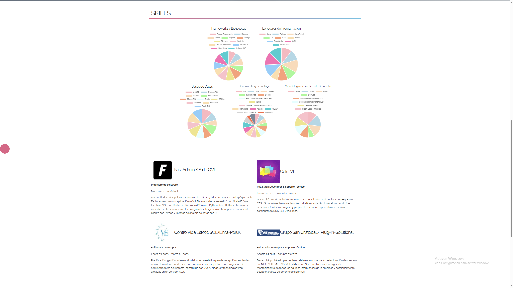

# Portfolio

Este es el repositorio del portafolio personal de Isaac Vera Ponce, un ingeniero de software. En este portafolio, Isaac muestra su experiencia laboral, habilidades técnicas, y proporciona información de contacto.

## Contenido

- [Demo](#demo)
- [Tecnologías Utilizadas](#tecnologías-utilizadas)
- [Instrucciones de Uso](#instrucciones-de-uso)
- [Capturas de Pantalla](#capturas-de-pantalla)
- [Autor](#autor)

## Demo

Puedes ver una demostración del portafolio en [este enlace](#) (añadir enlace una vez disponible).

## Tecnologías Utilizadas

El portafolio está desarrollado utilizando las siguientes tecnologías:

- HTML5
- CSS3
- JavaScript
- Vue.js
- Chart.js
- Bootstrap
- NodeJs
- Express
- Socket.IO

## Instrucciones de Uso

1. Clona este repositorio en tu máquina local utilizando Git:

https://github.com/IsaacVeraPonce/Portfolio.git

2. Instala las dependencias en la carpeta server npm install

3. Arranca el servidor con node index.js o npm run test

4. Abre el enlace http://localhost/ en tu navegador web preferido.

## Capturas de Pantalla

## Autor

Este proyecto fue desarrollado por [Isaac Vera Ponce](#) como parte de su portafolio personal.

Si tienes alguna pregunta o comentario, no dudes en [contactar a Isaac](#).
